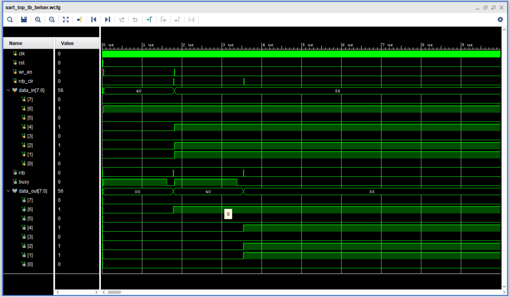
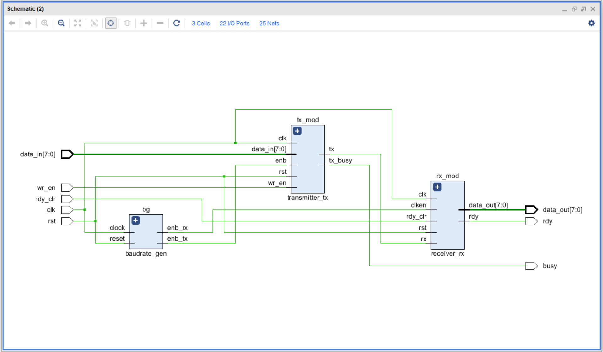

# UART Communication Protocol

UART Transmitter and Receiver implementation in Verilog HDL using Xilinx Vivado.

## Project Structure

rtl/
- baudrate_gen.v
- transmitter_tx.v
- receiver_rx.v
- uart_top.v

sim/
- uart_top_tb.v

## Features

- UART Transmission
- UART Reception
- Baud Rate Generator
- Simulation Verified

## Simulation Waveform

## RTL Schematic

## Tools Used

- Verilog HDL
- Xilinx Vivado 2018.2

## Module Description

### baudrate_gen
Generates the baud rate clock used for UART transmission and reception.

### transmitter_tx
Serializes parallel data and transmits it over the UART TX line.

### receiver_rx
Receives serial UART data and reconstructs the original parallel data.

### uart_top
Top-level module integrating baud rate generator, transmitter, and receiver.

### uart_top_tb
Testbench used to verify UART functionality through simulation.
